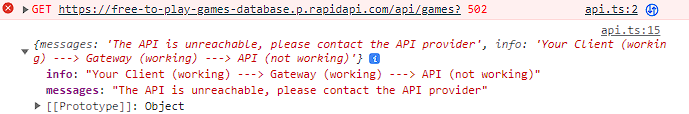

# Тестовое задание free-to-play-games

## P.S.
Рекомендованное API (https://www.freetogame.com/api-doc), как будто бы,
блокирует ключ доступа CORS после "многочисленных" запросов. 
Либо же просто проблемы на их стороне.
В связи с этим нет гарантии, что  данные успешно отправятся, ибо ответ то приходит, то нет :(

# P.P.S

## Установка
Для запуска приложения необходимо склонировать репозиторий и в корневом каталоге прописать
следующие команды:

- npm i (Для установки зависимостей)
- npm start (Для локального запуска приложения на localhost:3001)

## Ссылка на решение

Функционал можно также посмотреть здесь, если, конечно, API будет работать :)

- https://ggermashev.github.io/free-to-play-games